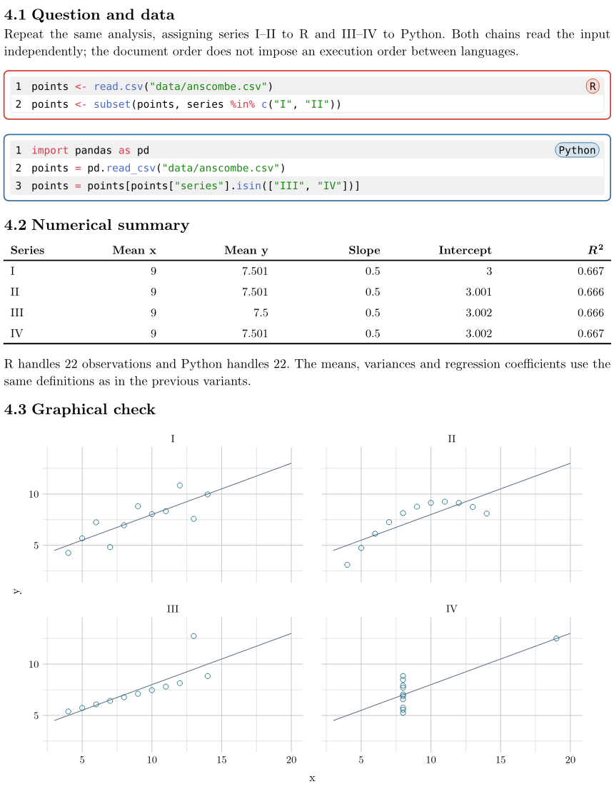
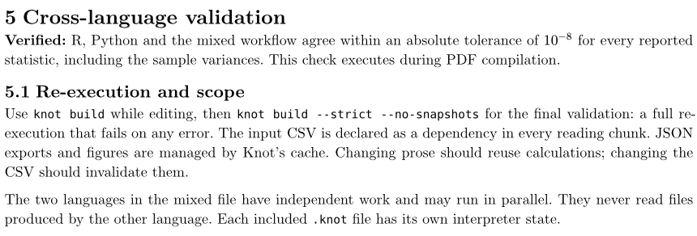

# Scientific reference: Anscombe's quartet

The [Anscombe project](https://github.com/knot-literate-programming/knot/tree/master/examples/anscombe)
contains three comparable analyses of the same versioned dataset:

- R with ggplot2;
- Python with plotnine;
- independent R and Python calculations, combined graphically in Typst with Gribouille.

[Read the generated PDF](./assets/anscombe.pdf) (five pages). In the mixed
variant, R and Python each compute two series; Typst draws the table and the
figure from the exported results:

The three variants are then compared during Typst compilation:

The report includes tables, inline values, figures, a bibliography and numerical
checks between languages. It demonstrates [data exports](./data-exports.md) with
`export_data` and explicit dependencies on the input CSV. A separate diagnostic
variant demonstrates warnings, runtime errors, blocked downstream chunks and
recovery.

Follow the example's README to install its dependencies and run `knot build`.
For the final validation, use `knot build --strict --no-snapshots`: it
re-executes the whole analysis in fresh interpreters and fails if the document
shows an error (see [From exploration to publication](./exploration-to-publication.md)).
